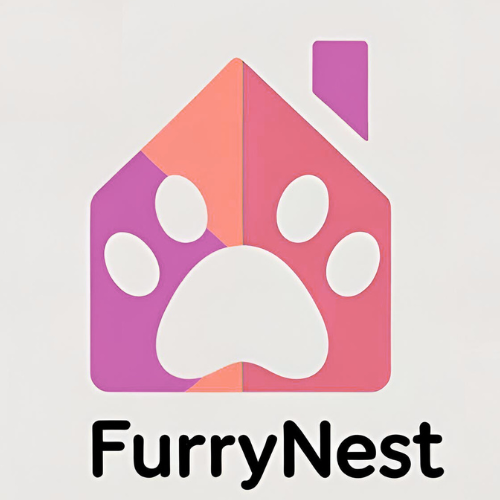

# FurryNest

FurryNest is a fullstack web application for pet adoption, built with React (frontend) and Node.js/Express/MongoDB (backend). Users can browse pets, sign up, and manage adoptions, with all user data stored securely in MongoDB Atlas.

## Features

- Modern React frontend (Vite, React Router, component-based)
- User authentication (Sign Up, Sign In)
- Dashboard for logged-in users
- Pet adoption pages (dogs, cats, details)
- Blog, contact, and ways-to-help pages
- Responsive design
- Backend REST API (Express, MongoDB Atlas, JWT-ready)
- Secure password hashing (bcryptjs)
- CORS and environment variable support

## Project Structure

```
FurryNest/
├── public/                # Static assets
├── src/                   # React frontend
│   ├── components/        # Header, Footer, ProtectedRoute
│   ├── pages/             # All main pages (SignUp, SignIn, Dashboard, etc.)
│   ├── style/             # CSS files
│   └── ...                # App.jsx, main.jsx, etc.
├── server/                # Node.js backend
│   ├── controllers/       # API logic (userController.js)
│   ├── db/                # MongoDB connection (connect.js)
│   ├── models/            # Mongoose schemas (user_info.js)
│   ├── routes/            # Express routes (routes.js)
│   ├── .env               # Environment variables (MONGO_URI, PORT)
│   └── index.js           # Server entry point
├── package.json           # Frontend dependencies
├── vite.config.js         # Vite config (with API proxy)
└── README.md
```

## Getting Started

### Prerequisites

- Node.js (v18+ recommended)
- npm

### 1. Clone the repository

```bash
git clone https://github.com/shakhawat-hossain-shoaib/FurryNest.git
cd FurryNest/FurryNest
```

### 2. Install dependencies

#### Frontend

```bash
npm install
```

#### Backend

```bash
cd server
npm install
```

### 3. Configure Environment

Create a `.env` file in `server/` with your MongoDB Atlas URI:

```
MONGO_URI=your_mongodb_atlas_uri
PORT=5000
```

### 4. Run the Application

#### Start Backend

```bash
cd server
npm run dev
```

#### Start Frontend

Open a new terminal in the root folder:

```bash
npm run dev
```

Visit [http://localhost:5173](http://localhost:5173) in your browser.

## API Endpoints

- `POST /api/users` — Register a new user
- `GET /api/users` — List all users (for testing)
- (Extend with more endpoints as needed)

## Deployment

- Configure your production MongoDB URI and environment variables.
- Use a process manager (like PM2) for backend.
- Build frontend with `npm run build` and serve with a static server or integrate with backend.

## Project Screenshot



## License

Shoaib, Hasan, Rifat
