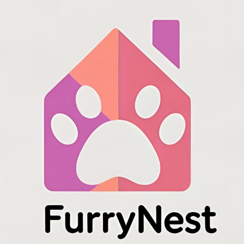
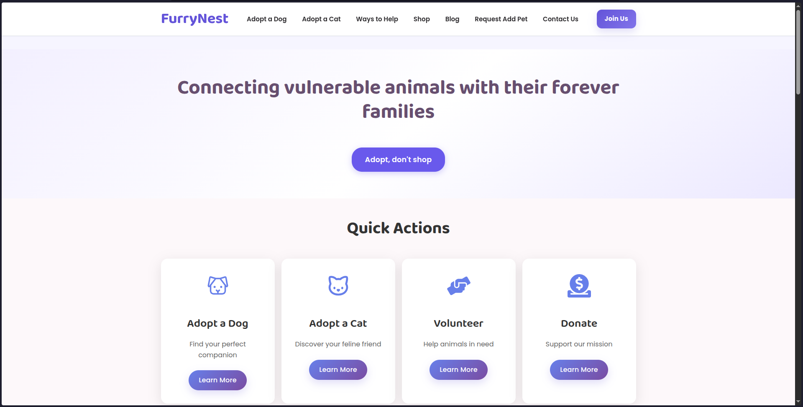
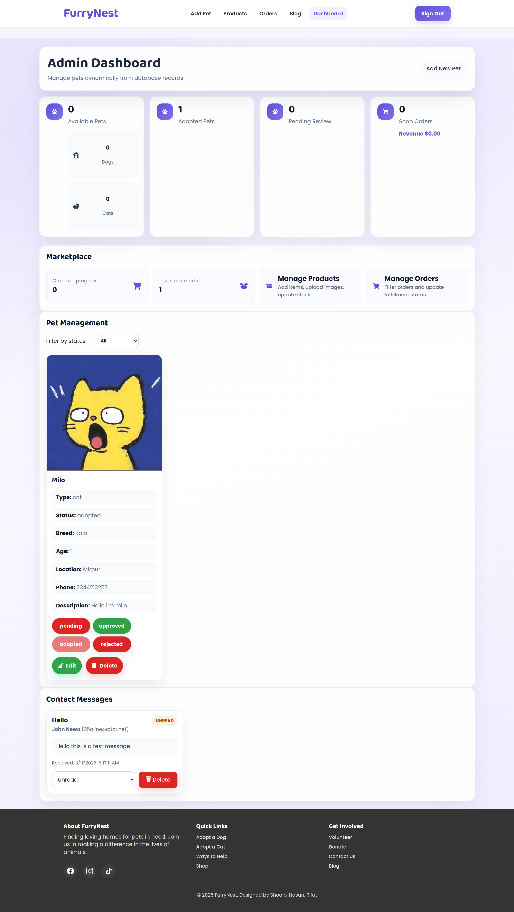

<p align="center">
  
</p>

# FurryNest

FurryNest is a full-stack pet adoption and pet-care marketplace app.
It includes public pet browsing, adoption workflow, admin moderation, blog management, donations, volunteer signup, contact forms, and a simple shop/cart/order system.

## Features

- Pet listing and filtering (dog/cat) with details page
- Pet request submission with image upload
- Admin dashboard for pet moderation and status updates
- JWT-based user and admin authentication
- Donations, volunteers, and contact form handling
- Shop products, cart, orders, and order status tracking
- Blog create/read/update/delete flows
- Responsive React UI

## Tech Stack

- Frontend: React, React Router, Vite, Axios, React Icons
- Backend: Node.js, Express, Mongoose, JWT, bcryptjs, multer
- Database: MongoDB

## Project Structure

```text
FurryNest/
|- client/
|  |- src/
|  |  |- assets/
|  |  |- components/
|  |  |- context/
|  |  |- pages/
|  |  |- services/
|  |  `- utils/
|  |- index.html
|  |- vite.config.js
|  `- package.json
|- server/
|  |- controllers/
|  |- db/
|  |- middleware/
|  |- models/
|  |- routes/
|  |- uploads/
|  `- server.js
|- package.json
`- README.md
```

## Prerequisites

- Node.js 18+
- npm 9+
- MongoDB connection string (Atlas or local)

## Getting Started

### 1. Clone repository

```bash
git clone https://github.com/shakhawat-hossain-shoaib/FurryNest.git
cd FurryNest/FurryNest
```

### 2. Install dependencies

```bash
cd client
npm install
cd ..
cd server
npm install
cd ..
```

### 3. Create environment file

Create `server/.env` with the following values:

```env
MONGO_URI=your_mongodb_connection_string
PORT=5000
JWT_SECRET=your_jwt_secret
```

The backend explicitly loads environment variables from `server/.env`.

### 4. Run development servers

Terminal 1 (backend):

```bash
npm run dev:server
```

Terminal 2 (frontend):

```bash
npm run dev:client
```

Frontend runs on `http://localhost:5173`.
Vite proxies `/api` and `/uploads` requests to `http://localhost:5000`.

## Scripts

Root (`/`):

- `npm run dev:client` - start Vite dev server from `client/`
- `npm run build:client` - create production frontend build
- `npm run preview:client` - preview production frontend build
- `npm run lint:client` - run frontend ESLint
- `npm run dev:server` - start API server with nodemon
- `npm run start:server` - start API server with node

Server (`/server`):

- `npm run dev` - start API server with nodemon
- `npm run start` - start API server with node

## Screenshots

### Home Page


### Admin Dashboard


## Troubleshooting

- MongoDB connection issues (`ENOTFOUND`, `NXDOMAIN`, auth failed): verify `MONGO_URI` and network access.
- 401/403 on admin actions: confirm valid login and token is being sent.
- Image not loading: ensure backend is running and `/uploads` is reachable.
- Frontend API calls failing: confirm backend is listening on port `5000`.

## License

ISC
